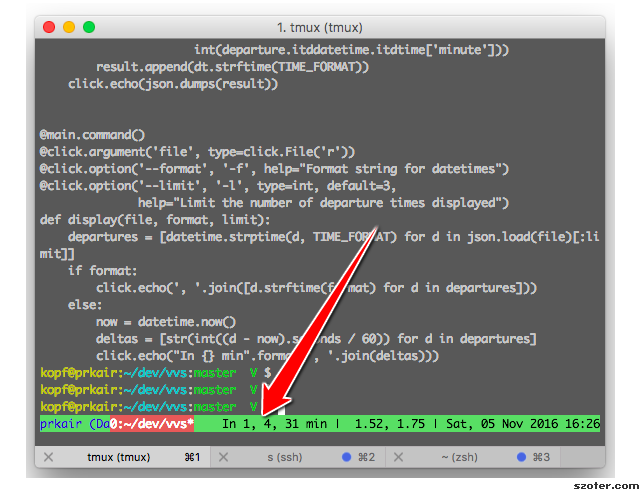

vvs
===

``vvs`` is a set of tools for displaying upcoming departure times of buses, trains
and trams from stations in the Verkehrsverbund Stuttgart.

Having started a new job, I was unfamiliar with the tram timetable for getting
home, and wanted a simple way of seeing, at a glance, how much time I have until
the next tram leaves for home.

I spend most of my working day staring at a computer terminal, always in a tmux
session, so that seemed like a good fit:

In the screenshot above, you can see that there are two trams leaving very shortly,
after which the next one is in a half an hour. So, it's easy to quickly decide
whether it's worth it to jump up and rush out the door, without having to waste
time opening up the VVS website.

What it isn't
-------------

``vvs`` isn't a console client for the VVS website. It won't allow you to check
routes and connections between two stops, for example (although this could be
implemented with relatively little difficulty).

Getting Started
---------------

Installation
~~~~~~~~~~~~

Install using pip3:

.. code-block::

    pip3 install vvs

It goes without saying that you should install into a virtualenv.

Finding your station ID
~~~~~~~~~~~~~~~~~~~~~~~

Have a look in the stations.json_
file for the station that you want to monitor. Every station is paired with an
ID, and you'll need this when running ``vvs``.

Please note that the ``stations.json`` file in this repo won't be kept updated.
If you can't find your station ID, follow the instructions here_.

.. _stations.json: https://github.com/kopf/vvs/blob/master/stations.json
.. _here: https://github.com/LUGBB/vvs-station-monitor#get-station-id

Setting up the scraper
~~~~~~~~~~~~~~~~~~~~~~

Now we've got our station ID, we'll want to scrape data for that station. This
can be achieved by using the ``vvs scrape`` command. We'll then want to cache this
data somewhere locally. So, if our station ID were 5007115 (Hulb), we'd set up
a cronjob to do this every few minutes:

.. code-block::

    */3 * * * * vvs scrape 5007115 > ~/.vvs.json

With this command, we'll be tracking the departures of all public transport
from Hulb - but in both directions. We just want departures heading in to town.

In order to filter for what we want, we first use the ``list_directions`` subcommand:

.. code-block::

    $ vvs list_directions 5007115
    Herrenberg
    Kirchheim (T)
    Neckarpark
    Plochingen
    $

This is a list of all terminating stations for public transport passing through
Hulb. Departures of the S-Bahn in the direction of Kirchheim an der Teck and
Plochingen are the ones we're after, so we'll filter for them:

.. code-block::

    */3 * * * * vvs scrape 5007115 --direction Plochingen --direction 'Kirchheim (T)' > ~/.vvs.json

Now we should be getting the data we're after!

Displaying the data
~~~~~~~~~~~~~~~~~~~

The ``vvs display`` command is used to display the data we've saved. The style
in which it displays the data can be customized:

.. code-block::

    $ vvs display ~/.vvs.json
    In 7, 22, 37 min
    $
    $ vvs display --limit 10 ~/.vvs.json
    In 6, 21, 36, 51, 66, 81, 96, 114, 144, 174 min
    $
    $ vvs display --limit 10 --format %H:%M ~/.vvs.json
    19:25, 19:40, 19:55, 20:10, 20:25, 20:40, 20:55, 21:13, 21:43, 22:13
    $

Python's time formatting directives (link_) are used for string formatting.

.. _link: https://docs.python.org/3/library/datetime.html#strftime-strptime-behavior

Troubleshooting
---------------

Locales
~~~~~~~

If you get an error that looks like this:

.. code-block::

    RuntimeError: Click will abort further execution because Python 3 was configured to use ASCII as encoding for the environment.

Make sure you have your locales set correctly (``LC_ALL`` and ``LANG`` are ``export``ed).
If that's not possible, then set them temporarily when you invoke ``vvs`` , e.g.:

.. code-block::

    LC_ALL=en_US.utf-8 LANG=en_US.utf-8 vvs scrape 5007115

Contact
-------

Aengus Walton ventolin@gmail.com
